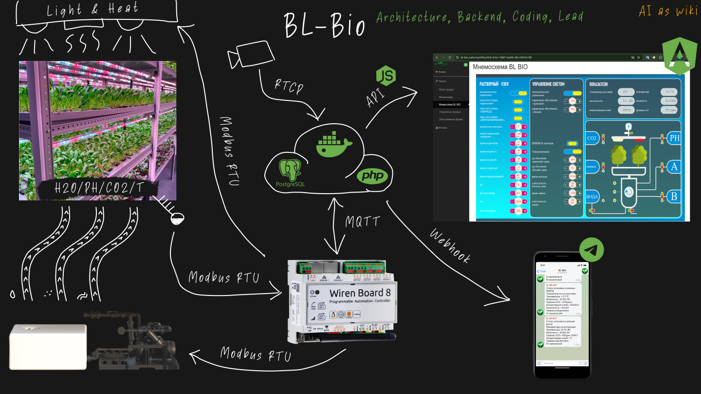

### БЛ Био (Мониторинг теплиц) | [Сайт проекта](https://bl-bio.ru)  

Веб-приложение для мониторинга и управления параметрами в теплицах (освещение, полив, удобрения).

**Задача:**
В сжатые сроки реализовать MVP продукта для управления "умными" теплицами.

**Решение:**
За основу были взяты промышленные контроллеры **Wiren Board**, которые поставлялись с open-source веб-приложением. Я доработал это приложение и обернул его в веб-портал с авторизацией. Пользователи могли получать доступ к своим теплицам, управлять параметрами и просматривать видео с камер.

**Архитектура и стек:**
- **Контроллер:** Wiren Board, взаимодействующий с оборудованием по протоколу Modbus.
- **Backend:** PHP-сервер, который общался с контроллером через MQTT и предоставлял API для фронтенда.
- **Frontend:** Веб-интерфейс на **Angular**, который я дорабатывал.
- **База данных:** PostgreSQL для хранения данных.

**Моя роль:**
На этом проекте я выступал в роли **full-stack разработчика** и **аналитика**. Я написал ТЗ, доработал backend на PHP и frontend на Angular для реализации требуемого функционала.
