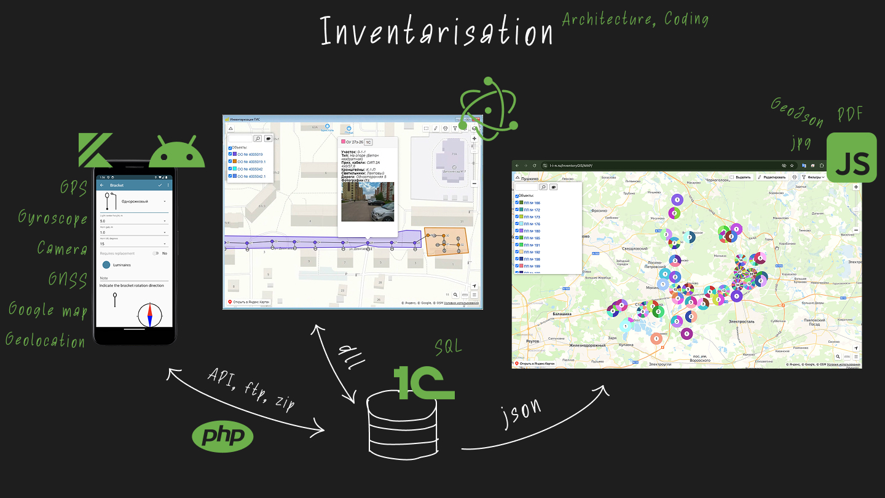

### Инвентаризация объектов освещения | [Сайт проекта](https://idc-blg.ru/inventory)  

Программный комплекс, созданный для автоматизации процесса сбора и учета данных об объектах наружного освещения.

**Проблема:**
Бизнес-процесс инвентаризации был полностью ручным: данные собирались на бумаге, а для их оцифровки и нанесения на карту привлекались сторонние подрядчики, что было долго и дорого.

**Решение:**
Я предложил и реализовал комплексное решение:
- **Android-приложение** для сбора данных в "полях".
- **Сервер и база 1С** для централизованного хранения информации.
- **Desktop-приложение (Electron)** для визуализации объектов на карте и управления данными.
- **Автоматическая генерация PDF-отчетов** и предоставление веб-доступа к результатам для заказчиков.

**Результат:**
Решение позволило полностью отказаться от услуг подрядчиков, автоматизировать сбор и обработку данных, что значительно сократило время и затраты.

**Моя роль:**
Я был ключевым техническим специалистом на проекте, выполняя роли **аналитика, full-stack разработчика (JS, Node.js, Electron)** и, со временем, **руководителя проекта**. Я писал ТЗ, разрабатывал ключевые компоненты системы и управлял небольшой командой (дизайнер, тестировщик, 1С-разработчик).
