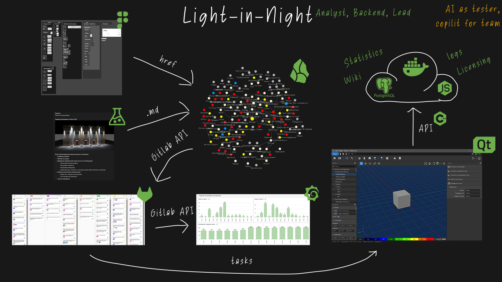

### Light in Night Pro — Desktop-приложение для проектирования освещения | [Сайт проекта](https://l-i-n.ru)  

Проект **Light in Night Pro** — это комплексное desktop-приложение для профессионального проектирования внутреннего и наружного освещения.

**Задача:**
Мне было поручено взять проект на стадии "техно-демки" с неорганизованными процессами и превратить его в полноценный продукт.

**Что было сделано:**
1.  **Организация процессов:** Собрал требования, написал ТЗ, внедрил Gitlab Issues для ведения задач и настроил связь ТЗ и ISSUE. Разработал план выпуска версий и сформировал бэклог, вывел ститистику выполнения задач.
2.  **Формирование команды:** Собрал команду, наняв тестировщика, UX/UI-дизайнеров, Backend и Frontend-разработчиков.
3.  **Техническое руководство:** Управлял командой из 10+ человек (C++, Python, Frontend, DevOps, QA, Design). Настроил сбор логов и метрик через Elasticsearch/Kibana/Grafana. Разрабатывал backend-модули на Python.
4.  **Внедрение AI:** Инициировал использование LLM для автоматизации UI-тестирования и ускорения разработки (aider).

**Моя роль:**
Выступал в роли **Team Lead** и **Продуктового аналитика**. Отвечал за аналитику, написание ТЗ, планирование, разработку backend-части и общее руководство проектом.
