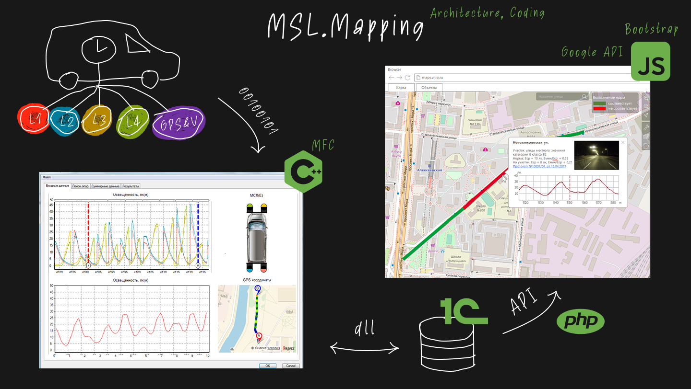

### МСЛ Картирование | [Сайт проекта](https://vnisi.ru/ispytaniya/mobile/)  

Проект, выполненный в рамках магистерской дипломной работы совместно с ВНИСИ им. Вавилова. Целью была разработка системы для сбора, обработки и визуализации данных с мобильной светотехнической лаборатории (МСЛ).

**Задача:**
Создать программный комплекс, который бы обрабатывал бинарные данные с различных датчиков автомобиля (освещенность, скорость, GPS), сохранял их в базу данных 1С и отображал на интерактивной веб-карте.

**Архитектура и стек:**
- **Сбор и обработка данных:** Desktop-приложение на **C++/MFC** для обработки сырых данных с датчиков.
- **Хранение:** Данные передавались в базу **1С**.
- **Визуализация:** Веб-интерфейс на **JavaScript** с использованием **Google Maps API** и **Bootstrap** получал данные из 1С через API на PHP и наносил их на карту.

**Результат:**
Система позволила объединить на одной карте огромное количество измерений, что дало возможность оценивать состояние освещения в масштабах целых городов и проводить глобальные исследования.

**Моя роль:**
Я был основным разработчиком проекта, отвечая за:
- Написание математических алгоритмов.
- Разработку desktop-приложения на **C++**.
- Создание frontend-части на **JavaScript**.
- Частичное написание ТЗ и тестирование.

