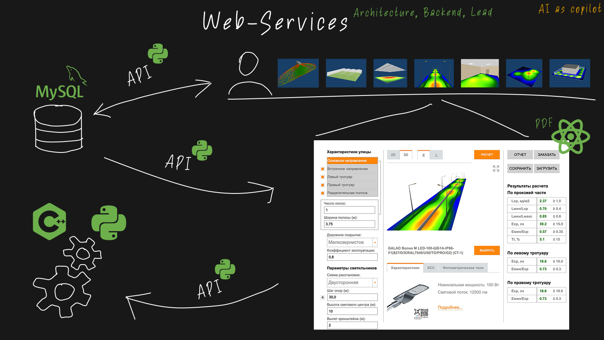

### Онлайн-калькуляторы (Galad.ru)

Проект представлял собой серию **онлайн-сервисов** на сайте Galad.ru, предназначенных для расчета различных сценариев освещения (дорожного, офисного, тепличного и т.д.).

**Бизнес-цель:**
Привлечь новых клиентов на сайт и увеличить конверсию в заказы светотехнического оборудования.

**Решение и результаты:**
Я предложил и реализовал набор онлайн-калькуляторов, объединенных личным кабинетом. Пользователи могли сохранять проекты, делиться ими и формировать отчеты в PDF, а также сразу оформлять заказ на используемое оборудование.
- **Результат:** Конверсия в заказы увеличилась на **20%**.

**Архитектура и стек:**
Backend был реализован на **Python** в виде сервисов, работающих в **Docker**. В качестве базы данных использовался **PostgreSQL**. Логи собирались в **Elasticsearch/Kibana**.

**Моя роль:**
- **Tech Lead:** Организовал процесс разработки с нуля, нанял Frontend-разработчика и управлял командой (дизайнер, 2 frontend, тестировщик, 1С, PHP, Python).
- **Backend-разработчик:** Спроектировал и написал систему микросервисов.
- **Аналитик:** Составил техническое задание на разработку.
