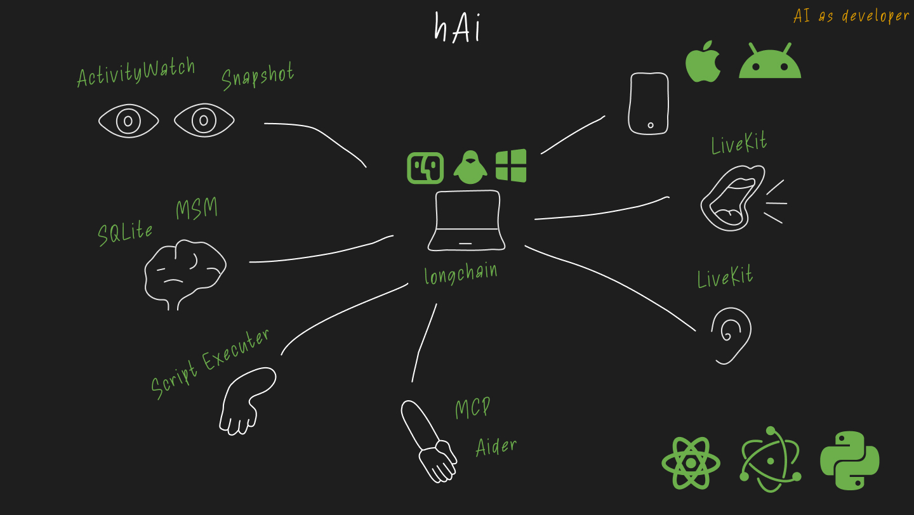

### hAi — Desktop AI-ассистент | [Сайт проекта](https://hi-ai.app/)

Проект **hAi** — это стартап, нацеленный на создание продвинутого AI-помощника для десктопа.

**Ключевая идея:**
Создать ассистента, который обладает когнитивной моделью памяти (сенсорная, краткосрочная, долгосрочная), отслеживает активность пользователя на компьютере (с помощью ActivityWatch) и предоставляет гибкие возможности для взаимодействия и расширения.

**Архитектура и стек:**
Система построена по принципу **распределенного локального приложения**. Ядро на **Python/FastAPI** с **LangChain** управляет логикой, а специализированные сервисы, такие как **LiveKit** (голосовое общение) и **ActivityWatch** (мониторинг), работают как независимые компоненты. Это обеспечивает стабильность и слабую связность.

- **Backend:** Python, FastAPI, LangChain, SQLAlchemy.
- **Frontend:** Electron, React, TypeScript.
- **AI:** Интеграция с различными LLM (OpenAI, Gemini, Ollama), Computer Vision (Moondream) и STT/TTS-решениями (Whisper, Piper).
- **Протоколы:** REST, SSE и собственный **MCP (Model Context Protocol)** для подключения внешних инструментов.

**Моя роль:**
Я выполняю роли **Product Owner**, **Tech Lead** и **Backend-разработчика**. Я спроектировал архитектуру, руковожу командой из 6 человек (2xBackend, 2xFrontend, Analyst, Designer) и выстраиваю процессы разработки (JIRA, GitOps).
